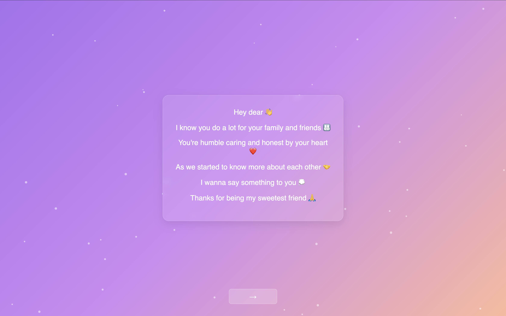
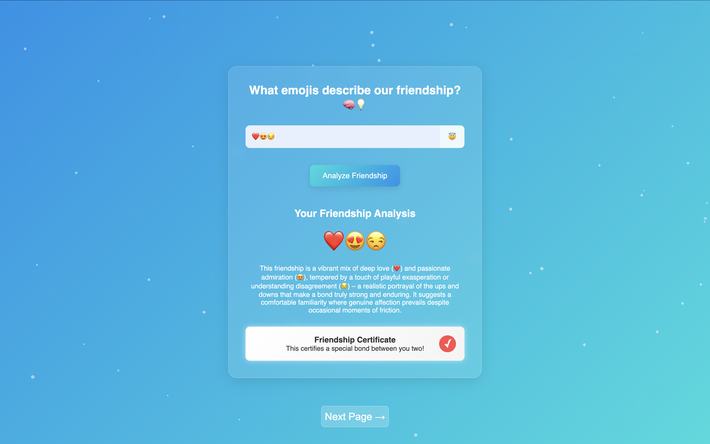
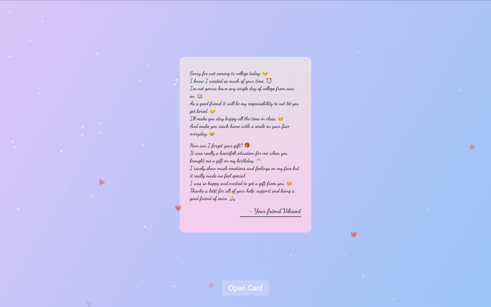

# 💌 Special Friend Website
*A multi-page interactive web experience made with love and a sprinkle of AI magic.*


---

## 📚 Table of Contents
- [Features](#-features)
- [Live Demo](#-live-demo)
- [Screenshots](#-screenshots)
- [Setup](#-setup)
- [Usage](#-usage)
- [Contributing](#-contributing)
- [License](#-license)

---

## ✨ Features

- **Sequential Message Display:** Heartfelt messages presented one-by-one ([`index.html`](index.html)).
- **Emoji Friendship Quiz:** Interactive quiz using emoji inputs ([`quiz.html`](quiz.html)).
- **AI-Powered Analysis:** Uses Google Gemini API for unique emoji-based friendship analysis ([`gemini_proxy.php`](gemini_proxy.php)).
- **Friendship Certificate:** A stylized digital certificate after the quiz.
- **Digital Apology Card:** Foldable card animation with a personalized message ([`apology.html`](apology.html)).
- **Smooth Animations:** Includes transitions, particle effects, and floating hearts ([`css/styles.css`](css/styles.css), [`js/main.js`](js/main.js)).
- **User Data Logging:** Logs emoji inputs and session details to [`friendship_data_log.txt`](friendship_data_log.txt) using PHP.
- **Responsive Design:** Works across all device sizes.
- **Session Management:** Tracks user flow via `sessionStorage`.

---

## 🚀 Live Demo

🔗 **[View the Website Live](https://nouzen-shinei.github.io/friendship/)**  

---

## 📸 Screenshots

| Message Page | Quiz Page | Apology Card |
|--------------|-----------|---------------|
|  |  |  |

---

## 🛠️ Setup

### 1. Web Server with PHP
Ensure you have a local or remote web server with PHP support (Apache/Nginx recommended).

### 2. Google Gemini API Key
- Get your Gemini API key from Google AI Studio.
- Open [`gemini_proxy.php`](gemini_proxy.php).
- Replace the placeholder key with your own:
    ```php
    $apiKey = "YOUR_ACTUAL_GEMINI_API_KEY";
    ```

> 💡 It's safer to store API keys in environment variables or config files, rather than hardcoding them.

### 3. File Permissions
Ensure write permissions for the log file:
```bash
chmod 664 friendship_data_log.txt
```

### 4. Deployment
Place all project files in your server’s root or subfolder (e.g., `/var/www/html/special-friend/`).

---

## 💻 Usage

1. Clone the repository:
    ```bash
    git clone https://github.com/nouzen-shinei/friendship.git
    ```
2. Follow setup steps above.
3. Open `index.html` in your browser (via localhost or domain).
4. Navigate through the interactive pages.
5. On the quiz page, enter emojis that best represent your friendship to get an analysis and a certificate!

---

## 🤝 Contributing

Contributions are welcome! Feel free to:
- Open issues
- Submit pull requests
- Suggest new features or improvements

Please follow standard GitHub contribution etiquette.

---

## 📄 License

This project is licensed under the **MIT License**.  

> _"This project is proprietary and not open for redistribution or commercial use."_  

---

## 🙏 Credits

Built with ❤️ by Shinei Nouzen.  
Special thanks to [Google Gemini API](https://ai.google.dev/) for powering the AI friendship analysis.

---
